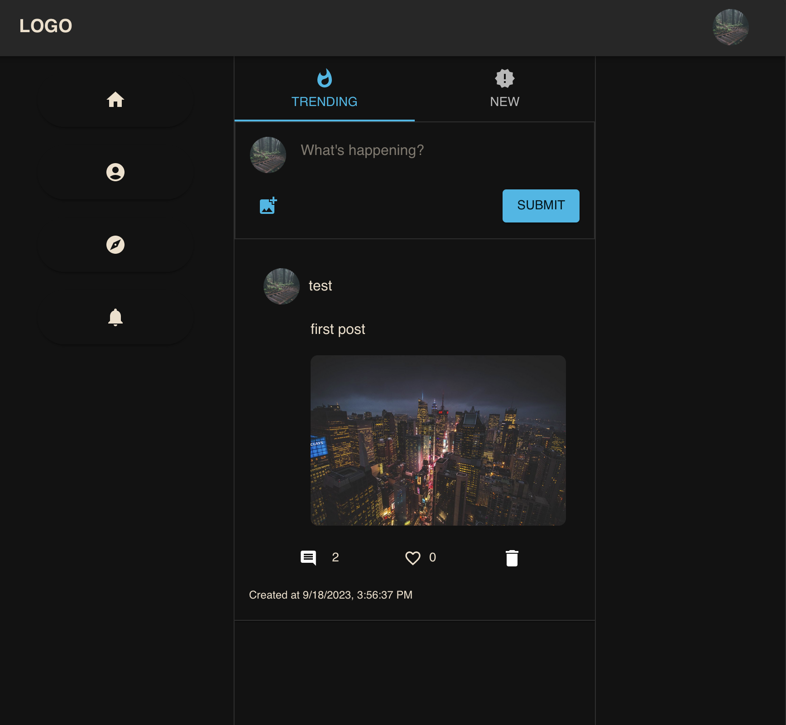
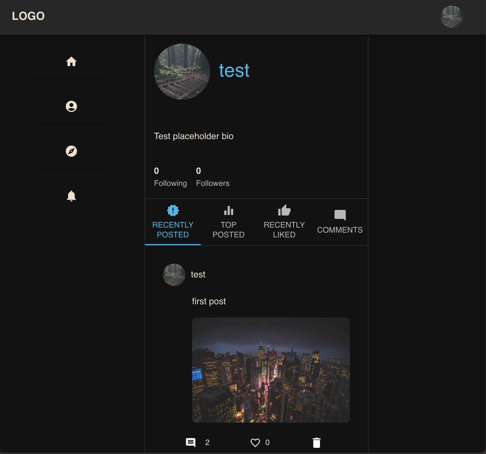
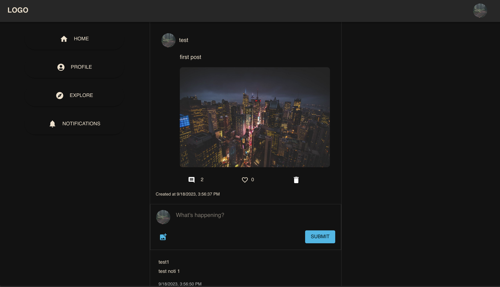

# SocialMedia App 🌐

## Overview
This app is a full-stack social networking platform built using the MERN stack (MongoDB, Express.js, React, Node.js). The application offers a rich set of features to elevate the user experience.

## Screenshots 📸
Below are some screenshots showcasing the functionality and user interface of the SocialMedia App:

- **Home Page**
  

- **Profile Page**
  

- **Post Page**
  

## Features 🚀

1. **OpenAI Language Content Moderation** 💬: Utilizes OpenAI's language models for efficient text content moderation.
2. **Google Vision API** 🖼️: Employs Google Vision API for image content moderation, ensuring appropriate visuals on the platform.
3. **Websockets** ⚡: Provides real-time notifications to users, enhancing interactivity and responsiveness.
4. **Posts & Comments** ✍️: Users can create posts, comment on existing ones, and interact with content from other users.
5. **Deleting Posts** 🗑️: Offers the ability to delete posts, giving users full control over their content.
6. **JWT Authentication** 🔒: Implements JWT for secure user authentication and session management.
7. **MVC Architecture** 📐: The application follows the Model-View-Controller (MVC) pattern for organized and maintainable code structure.
8. **RESTful API** 🌐: A well-structured REST API to ensure smooth communication between the frontend and backend.
9. **Amazon S3 Integration** 📦: Utilizes Amazon S3 for efficient and reliable image storage.

## Tech Stack 🛠️

- **Frontend**: React
- **Backend**: Node.js, Express.js
- **Database**: MongoDB
- **Real-time Communication**: Websockets
- **Image Storage**: Amazon S3
- **Authentication**: JWT

Thank you for checking out the project. If you're a recruiter, I'm eager to discuss the insights and challenges faced during the development of this application.

